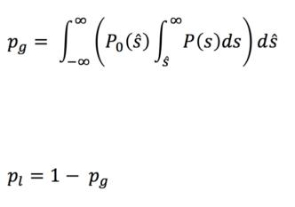

================
permutation_test
================

What is it
----------

Implementation of Fisher's permutation test.

The test is described in following publications:

- Fisher, R. A. (1935). The design of experiments. 1935. Oliver and Boyd, Edinburgh.

- Ernst, M. D. (2004). Permutation methods: a basis for exact inference. Statistical Science, 19(4), 676-685

How to install it
-----------------

Install with pip::

    $ pip install permutation_test

Command Line Script Usage
-------------------------

Example::
  
    permtest [path/to/data.csv] [groups_colname] [reference_group_name] -t [test_group_name]

Use help to get info about parameters::

    $ permtest -h

    usage: permtest [-h] [-t TESTGROUP]
                input_filepath treatment_column_name referencegroup

    positional arguments:
      input_filepath        e.g. path/to/my/data.csv, path to csv file with data
      treatment_column_name
                            name of column in the csv table that specifies the
                            group
      referencegroup        name of the reference group as named in the csv table

    optional arguments:
      -h, --help            show this help message and exit
      -t TESTGROUP, --testgroup TESTGROUP
                            name of the test group as named in th csv table. If
                            not defined, test group is determined automatically.
       -a ALPHA, --alpha ALPHA
                             significance level alpha (between 0 and 1) If not
                             defined, alpha is set to 0.05.
       -m MULTI_COMP_CORR, --multi_comp_corr MULTI_COMP_CORR
                             perform multiple comparison correction with benjamini
                             hochberg procedure yes/no, If not defined, correction
                             is performed.
                      

Specifications of data structure in csv file
--------------------------------------------

- The csv should contain comma separated values. One ore more columns should contain measurement data.

- All columns need to have a name, specified in the first row.

- One column contains names for the groups

Example *my_data.csv*:

============ ============ ============ ===========
experiment_1 experiment_2 experiment_3 group_names
============ ============ ============ ===========
1.4          3            2.5          condition_2  
2            5            2            condition_1
5.6          3            17           condition_2
9            6.5          2            condition_1
17           5            13.0         condition_1
17           2            13.0         condition_3
12           8            18.7         condition_3
============ ============ ============ ===========

To perform tests for all experiments, where *condition_1* is the reference and *condition_2* is
the test data, run follwoing command::

    $ permtest my_data.csv group_names condition_1 -t condition_2

Often, it is convenient to save the output in a textfile::

    $ permtest my_data.csv group_names condition_1 -t condition_2 > my_test_result.txt

Python Library Use Example
--------------------------
::

    >>> import permutation_test as p
    >>> data = [1,2,2,3,3,3,4,4,5]
    >>> ref_data = [3,4,4,5,5,5,6,6,7]

    >>> p_value = p.permutation_test(data, ref_data)
    taking random subsample of size 20000 from 48620 possible permutations
    nr of mean diffs: 20000

     Distribution of mean differences
                                           │                                        
                                        *  ┼+1.73038                                
                                           │  *                                     
                                           │                                        
                                     *     │      *                                 
                                           │                                        
                                  *        │         *                              
                                           │                                        
                                           │                                        
                              *            │             *                          
                                           │                                        
                                           │                                        
                           *               │                *                       
                                           │                                        
                        *                  │                   *                    
                                           │                                        
                    *                      │                       *                
             *   *                         ┼+0.037                    *   *         
    ───┼*****─***─**─***─**─**─***─**─**─**┼**─***─**─***─**─**─***─**─***─*****┼───
        -2.38713                           │                            +2.39919    
    mean difference of tested dataset: -2.0
    p_value: 0.00345
    p_lower_than (probability that mean of test data is not lower than mean of ref data): 0.00345
    p_value_greater_than (probability that mean of test data is not greater than mean of ref data): 0.9998
    0.0034500000000000121

The asccii art plot shows the ditribution of mean differences for the permutations. 
The ascii art plot is done with [AP](https://github.com/mfouesneau/asciiplot), a plotting package by Morgan Fouesneau.

If the number of possible combinations is grater than n_combinations_max,
a random subsample of size n_combinations_max is taken for histogram calculation.

If detailed is False, only (two-sided) p_value is returned,
i.e. the probability that data is not different from ref_data 

If detailed is True, one-sided p values and histogram data of 
mean differences is returned in a dict:

hist_data: distribution of mean differences for all permutations
p_value: two sided p_value (the probability that data is not
different from ref_data )
p_value_lower_than: the probability that mean of data is not 
lower than mean of ref_data
p_value_greater_than: the probability that mean of data is 
not grater than mean of ref_data 

Dealing with error propagation
------------------------------

permutationtest() allows the input of statistical error for each data point.
If data is provided in tuples

   [(x1, sigma1), (x2, sigma2), (x3, sigma3)]

instead of plain lists

   [x1, x2, x3]

the first value of the tuple is interpreted as the data point, the second value as
its standard deviation.  

To account for statistical errors σ, we modified Fisher's test by implementing following numeric approach:
For all permutations, each data point x_i (with error σ_i) was replaced with a random value r_i, where r_i is distributed following a Normal distribution N(μ, σ), with μ=x_i and σ= σ_i. In other words, we assumed normal distribution for the statistical error of the least squares fit. From now on following Fisher’s standard procedure, mean differences s for each permutation were calculated from these randomized data to finally obtain an empiric probability distribution P(s) of mean differences, describing the null hypothesis situation that both groups have identical distribution. 
To account for the error of the actual mean difference s_0 of the two populations, we followed the same approach as described above by repeatedly randomizing the data points and collecting 10000 mean differences (this time, of course, without permuting between the groups). Thus, we obtained an empirical probability distribution P0(s_0) of the actual mean difference. 

To account for statistical errors σ, we modified the test by implementing following numeric approach: For all permutations, each data point ai (with error σi) is replaced with a random value ri, where ri is distributed following a Normal distribution N(μ, σ), with μ=ai and σ= σi. In other words, normal distribution for the statistical error of the least squares fit is assumed. As for Fisher’s standard procedure, mean differences s for each permutation are calculated from these randomized data to finally obtain an empiric probability distribution P(s) of mean differences, describing the null hypothesis situation that both groups have identical distribution.
To account for the error of the actual mean difference 𝑠^ of the two populations, we follow the same approach of randomized sampling as described above, but this time without permuting between the groups. Thus, we obtain an empirical probability distribution P0(𝑠^).
The p values pg (probability that mean of test data is greater than mean of reference data)and pl (probability that mean of test data is lower than mean of reference data) are finally calculated by

   

Christoph Möhl and Manuel Schölling
Image and Data Analysis Facililty/Core Faciliies,
Deutsches Zentrum für Neurodegenerative Erkrankungen e. V. (DZNE) in der Helmholtz-Gemeinschaft
German Center for Neurodegenerative Diseases (DZNE) within the Helmholtz Association
